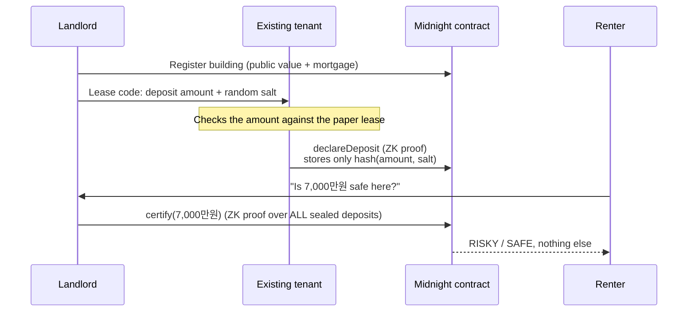

# 안심전세 ZK (SafeJeonse)

**Check that a jeonse deposit is safe before you sign, without anyone revealing what other tenants paid.**

Built on [Midnight](https://midnight.network/) for the Midnight Korea Hackathon 2026.

## 한국어 요약

**안심전세 ZK**는 전세 계약 전에 보증금이 안전한지 확인할 수 있게 해 주는 Midnight 기반 DApp입니다. 이 과정에서 다른 임차인의 보증금은 누구에게도 공개되지 않습니다.

- **문제:** 다가구 주택의 선순위 보증금은 등기부등본에 나오지 않습니다. 이 정보 공백이 전세사기의 주요 원인입니다.
- **해결:** 기존 임차인이 자신의 보증금을 해시 커밋먼트로 온체인에 봉인합니다. 임대인은 영지식 증명으로 `근저당 + 선순위 보증금 + 신규 보증금 ≤ 건물 가액의 70%`임을 증명하고, 예비 임차인은 **안전** 또는 **위험**이라는 결과만 확인합니다.
- **Midnight 활용:** witness(비공개 입력), `persistentHash` 커밋먼트, 모든 커밋먼트를 회로 안에서 검증하는 ZK 회로, `disclose`를 통한 선택적 공개.
- **실행:** `npm install`, `npm run compact`, `npm test` 후 `npm run demo`(터미널) 또는 `npm run web`(웹, 지갑 불필요).

## The problem

In Korea, a jeonse (전세) tenant hands the landlord a huge lump-sum deposit, often most of their savings. If the building is later sold at auction, the money is paid out in order of priority: the mortgage first, then tenants who moved in earlier, and only then the new tenant.

So before signing, a renter needs to know one thing: **how much is already owed on this building?**

The mortgage is easy to find because it's on the public property register (등기부등본). The deposits owed to earlier tenants (선순위 보증금) are not. In a multi-unit building (다가구) they're the missing piece, and that information gap is how most jeonse fraud (전세사기) happens. The landlord says "don't worry, it's safe," and the renter can't check.

The 2023 law change lets a renter ask to see earlier tenants' move-in and deposit records. That helps, but it has two problems:

1. **It exposes other tenants.** Your neighbours' deposits and move-in dates get shown to a stranger.
2. **It's still paperwork.** The records come on paper, with visits to government offices, at the moment you're under pressure to sign.

## The idea

SafeJeonse lets the landlord **prove** the building is safe for a new deposit, without revealing any existing tenant's deposit.

```
mortgage + every earlier tenant's deposit + your deposit  ≤  70% of the building's value
```

The renter learns one thing: **SAFE (안전)** or **RISKY (위험)**. Nobody learns what any other tenant paid.

## How it works



1. **The landlord registers the building.** Only public register data goes on-chain: the building value (공시가격), the senior liens (근저당) and the safe ratio.
2. **Each tenant seals their own deposit.** The landlord gives them a lease code (the amount plus a random salt). The tenant checks the amount against their paper lease and submits it. Only a salted hash is stored on-chain, in a slot owned by the tenant's key. Since the tenant submits it, **the landlord can't leave a deposit out or make it look smaller.**
3. **The landlord proves the verdict.** For a proposed new deposit, the landlord's machine builds a zero-knowledge proof. The proof shows that the private amounts behind **every** on-chain commitment add up, together with the mortgage and the new deposit, to at most the limit. Only the boolean result is disclosed.

When a tenant moves out and gets their deposit back, they withdraw their own slot. Any older certificate is then automatically flagged as out of date.

## What is public and what stays private

| Data | Where it lives | Who can see it |
|---|---|---|
| Building value, mortgage, safe ratio | On-chain | Everyone (it's already on the public register) |
| Number of sealed deposits | On-chain | Everyone |
| Each tenant's deposit amount | Tenant's and landlord's devices only | **Nobody else** |
| Commitment `hash(amount, salt)` | On-chain | Everyone, but it reveals nothing without the salt |
| Certificate: offered amount + SAFE/RISKY | On-chain | Everyone |

## How Midnight is used

| Midnight feature | Where | What it does here |
|---|---|---|
| **Witnesses** (private inputs) | [`safejeonse.compact:61-64`](contract/src/safejeonse.compact#L61-L64) | Deposit amounts and salts are fed into circuits from local private state and never leave the device |
| **`persistentHash` commitments** | [`depositCommitment`](contract/src/safejeonse.compact#L70) | Each deposit is stored as `hash(domain, amount, salt)` |
| **ZK circuit over private data** | [`certify`](contract/src/safejeonse.compact#L152) | Opens all 8 commitments inside the circuit, sums the amounts and compares against the limit |
| **Selective disclosure (`disclose`)** | [`certify`](contract/src/safejeonse.compact#L167-L170) | Only the SAFE/RISKY boolean and the offered amount are made public |
| **Key-bound authorization** | [`declareDeposit`](contract/src/safejeonse.compact#L119), [`withdrawDeposit`](contract/src/safejeonse.compact#L137) | Tenant and landlord public keys are derived from secret keys with role separation, so only the declaring tenant can withdraw and only the registered landlord can certify |
| **Ledger `Map` + `Counter` state** | [`safejeonse.compact:21-51`](contract/src/safejeonse.compact#L21-L51) | Slots, owners and a revision counter that marks stale certificates |

If a landlord feeds the circuit a forged amount, proof generation fails with `Deposit openings do not match the on-chain declarations`. The demo shows this happening on a real chain.

## Run it

### Prerequisites

| Tool | Version | Check |
|---|---|---|
| Node.js | 24.11.1 or newer | `node --version` |
| Docker Desktop | running | `docker info` |
| Compact compiler | 0.31.0 | `compact compile --version` |

Install the Compact compiler if you don't have it:

```bash
curl --proto '=https' --tlsv1.2 -LsSf https://github.com/midnightntwrk/compact/releases/latest/download/compact-installer.sh | sh
compact update 0.31.0
```

### 1. Install, compile and test (about 1 minute)

```bash
npm install
npm run compact     # compiles the contract and generates the ZK circuits
npm test            # 40 tests: contract circuits + API logic
```

Expected output from `npm run compact`:

```
Compiling 3 circuits:
```

### 2. Watch the whole story on a real local chain (about 4 minutes)

This starts a local Midnight node, indexer and proof server in Docker, then runs every step as a real transaction with a real zero-knowledge proof:

```bash
npm run demo
```

You'll see:

```
── 3. Choi asks: is a 7,000만 deposit safe here? ────────────────
  ✓ Kim proves the verdict over every declared deposit (23.8s)
  Verdict for 7,000만원: RISKY

── 4. A dishonest landlord tries to hide a deposit ─────────────
  ✓ The circuit refused: "Deposit openings do not match the on-chain declarations"

── 5. Lee moves out and gets her deposit back ──────────────────
  The old certificate is now marked out of date: yes
  Verdict for 7,000만원: SAFE

── 6. What is actually stored on-chain ─────────────────────────
  No individual deposit appears anywhere. Only commitments and the verdict.
```

The demo story, in 만원 (10,000 KRW):

| | Amount |
|---|---|
| Building value | 5억 (50,000) |
| Mortgage | 2억 (20,000) |
| Safe limit at 70% | 3억 5,000 (35,000) |
| Park's deposit (hidden) | 8,000 |
| Lee's deposit (hidden) | 5,000 |
| Choi is offered | 7,000 → 40,000 total → **RISKY** |
| After Lee moves out | 35,000 total → **SAFE** |

If the demo stops with `spawn docker-credential-desktop ENOENT`, Docker's helper tools aren't on your PATH. On macOS run:

```bash
export PATH="/Applications/Docker.app/Contents/Resources/bin:$PATH"
```

### 3. Try it yourself in the terminal

```bash
npm run start:local
```

The menu lets you register a building, create lease codes, and switch between the landlord, tenant and renter personas. Each persona has its own private state.

### 4. Web app, no wallet needed (recommended)

```bash
npm run web
```

This starts the same local Midnight network and serves the web app at <http://localhost:8787>. Proofs are built and transactions submitted on your machine, so there's no wallet extension, faucet or testnet account to set up.

A walk-through that matches the terminal demo:

1. Keep the defaults and click **Register building**.
2. As **임대인 Landlord**, create a lease code for `8000` and copy it.
3. Switch to **임차인 A Tenant**, paste the code and click **Seal deposit on-chain**.
4. Back as the landlord, create a code for `5000`. Seal it as **임차인 B Tenant**.
5. As the landlord, enter `7000` and click **Issue certificate**. The register gets a red 위험 (RISKY) seal.
6. Switch to **예비 임차인 Renter** and open **Show exactly what is stored on-chain**. There is no deposit amount anywhere.

One browser plays every role so you can walk through the flow. In real use each role is a different person on their own device, and each role here still keeps its own private state.

### 5. Web app on Preprod with Lace (optional)

The same UI can run against Midnight Preprod through the [Lace wallet](https://www.lace.io/):

```bash
npm run build -w contract
npm run build -w ui
npx http-server ui/dist -p 8080 -s
```

Set Lace to Midnight **Preprod** with the proof server on **Local** (`docker run -p 6300:6300 midnightntwrk/proof-server:8.0.3 midnight-proof-server -v`), and fund it from the [Preprod faucet](https://faucet.preprod.midnight.network/). This path depends on your wallet setup, so for judging we recommend the local web app above.

## Project layout

```
contract/   Compact contract, witnesses and simulator tests
  src/safejeonse.compact       the contract (3 ZK circuits)
  src/witnesses.ts             private state and witness functions
  src/test/                    15 circuit tests (fraud cases included)
api/        shared TypeScript API used by the CLI and the web app
  src/index.ts                 deploy / join / declare / withdraw / certify
  src/lease.ts                 lease codes and slot matching
  src/derive.ts                public + private view state
  src/test/                    25 tests
cli/        terminal app, scripted demo and local web server
  src/demo-story.ts            the story `npm run demo` runs
  src/web-server.ts            backend for `npm run web`
ui/         React web app (local server or Lace wallet)
```

## Limitations

- **The verdict leaks a little by design.** Anyone who sees many certificates for different amounts could narrow down the total of the earlier deposits. Individual deposits still stay hidden. Under current Korean law a renter can already ask for these records in full, so revealing only the total is still less than what they could see today. Only the landlord can issue certificates, which limits how many are made.
- **Register data is entered by the landlord.** Building value and mortgage are public and anyone can check them against the 등기부등본, but the contract doesn't fetch them itself. A production version would take them from an official data feed or attester.
- **Tenants need to take part.** A tenant who never seals their deposit isn't counted. In production, sealing should happen where leases are already registered (확정일자 at the community centre or online), so every lease is included automatically.
- **Fixed size.** A building has up to 8 unit slots, which fits a typical 다가구. It's a constant in the contract.
- **Lease-code salts are shared with the landlord.** The landlord already knows each deposit (they received it), so this reveals nothing new to them.

## Roadmap

- Pull building value and liens from an official attester instead of trusting the form
- Integrate sealing with 확정일자 registration so no lease can be skipped
- A shareable certificate link a renter can verify on their phone
- Support larger buildings (more slots) and HUG deposit-insurance ratios

## Credits

Scaffolded from the official [midnightntwrk/example-bboard](https://github.com/midnightntwrk/example-bboard) template (Apache-2.0). Wallet and environment bootstrapping in `cli/` and `ui/` is adapted from it.
